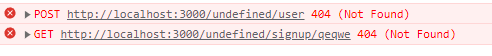

# 2023.7.8
1. React어플의 기본 틀을 만들고 홈/테스트용/로그인/회원가입 라우터를 만들었습니다.
2. 로그인과 회원가입의 기본적인 구현을 위해 구조를 잡고 필요한 내용들을 조금씩 작성
   하였습니다.
3. 동작 중 오류가 발생하여 수정방안을 찾아보기로 하였습니다.   
   store.js에서 스토어를 생성 후 index.js 파일에서 App 컴포넌트를 Provider 컴포넌트로 감싸는 형식의 코드로 변경하여 일부를 해결하였습니다.

# 2023.7.9 
1. 오류 수정을 위해 리액트 문법을 최신 버전 기준으로 갱신하였습니다.
  history->navigate, Switch->Routes, ReactDOM.render()->ReactDOM.createRoot()
2. 에러메시지 해결 후 각 라우터로 제대로 이동하는지와 각 기능들이 제대로 동작하는지를
  확인하였습니다.
3. 로그인/회원가입 시 백으로 적절한 요청을 보내는지 확인하였습니다.
