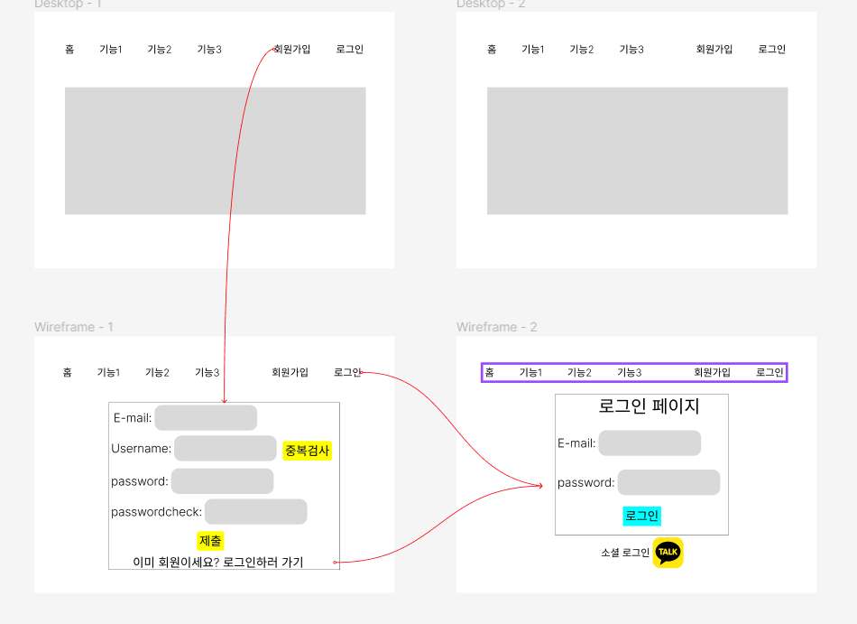

### npm install npm start 하시면 리액트 실행됩니다!

# 2023.7.8

1. React어플의 기본 틀을 만들고 홈/테스트용/로그인/회원가입 라우터를 만들었습니다.
2. 로그인과 회원가입의 기본적인 구현을 위해 구조를 잡고 필요한 내용들을 조금씩 작성
   하였습니다.
3. 동작 중 오류가 발생하여 수정방안을 찾아보기로 하였습니다.  
   store.js에서 스토어를 생성 후 index.js 파일에서 App 컴포넌트를 Provider 컴포넌트로 감싸는 형식의 코드로 변경하여 일부를 해결하였습니다.

# 2023.7.9

1. 오류 수정을 위해 리액트 문법을 최신 버전 기준으로 갱신하였습니다.
   history->navigate, Switch->Routes, ReactDOM.render()->ReactDOM.createRoot()
2. 에러메시지 해결 후 각 라우터로 제대로 이동하는지와 각 기능들이 제대로 동작하는지를
   확인하였습니다.
3. 로그인/회원가입 시 백으로 적절한 요청을 보내는지 확인하였습니다.
   
   사진에서 undefined라고 되어있는 곳은 REACT_APP_SERVER_DOMAIN 입니다.
   이는 환경변수 저장하는 폴더에서 관리할 계획입니다.

# 2023.7.10

1. 패키지 트리 익스텐션 사용. ctrl + shift + p로 찾아서 사용하면 리드미에 자동으로 추가해줍니다.
2. 부트스트랩 대신 material-ui를 자주 사용할 예정입니다.

# 현재 구조

```
test_for_React
├─ .env.example
├─ .git
│  ├─ config
│  ├─ description
│  ├─ HEAD
│  ├─ hooks
│  │  ├─ applypatch-msg.sample
│  │  ├─ commit-msg.sample
│  │  ├─ fsmonitor-watchman.sample
│  │  ├─ post-update.sample
│  │  ├─ pre-applypatch.sample
│  │  ├─ pre-commit.sample
│  │  ├─ pre-merge-commit.sample
│  │  ├─ pre-push.sample
│  │  ├─ pre-rebase.sample
│  │  ├─ pre-receive.sample
│  │  ├─ prepare-commit-msg.sample
│  │  ├─ push-to-checkout.sample
│  │  ├─ sendemail-validate.sample
│  │  └─ update.sample
│  ├─ index
│  ├─ info
│  │  └─ exclude
│  ├─ logs
│  │  ├─ HEAD
│  │  └─ refs
│  │     ├─ heads
│  │     │  └─ main
│  │     └─ remotes
│  │        └─ origin
│  │           └─ HEAD
│  ├─ objects
│  │  ├─ info
│  │  └─ pack
│  │     ├─ pack-23fb19941d07948b696eb95035191af638389add.idx
│  │     ├─ pack-23fb19941d07948b696eb95035191af638389add.pack
│  │     └─ pack-23fb19941d07948b696eb95035191af638389add.rev
│  ├─ packed-refs
│  └─ refs
│     ├─ heads
│     │  └─ main
│     ├─ remotes
│     │  └─ origin
│     │     └─ HEAD
│     └─ tags
├─ .gitignore
├─ package-lock.json
├─ package.json
├─ public
│  ├─ favicon.ico
│  ├─ index.html
│  ├─ logo192.png
│  ├─ logo512.png
│  ├─ manifest.json
│  └─ robots.txt
├─ README.md
├─ README_img
│  └─ 로그인_회원가입_서버에요청.png
└─ src
   ├─ actions
   │  └─ index.js
   ├─ App.js
   ├─ App.test.js
   ├─ components
   │  └─ Header.js
   ├─ index.css
   ├─ index.js
   ├─ indexjs
   ├─ pages
   │  ├─ About.js
   │  ├─ Home.js
   │  ├─ LogInPage.js
   │  └─ SignUpPage.js
   ├─ reducers
   │  ├─ index.js
   │  ├─ initialState.js
   │  └─ logInStatusReducer.js
   ├─ reportWebVitals.js
   ├─ setupTests.js
   ├─ store.js
   └─ utilities
      └─ availCheck.js

```

# 2023.7.11


