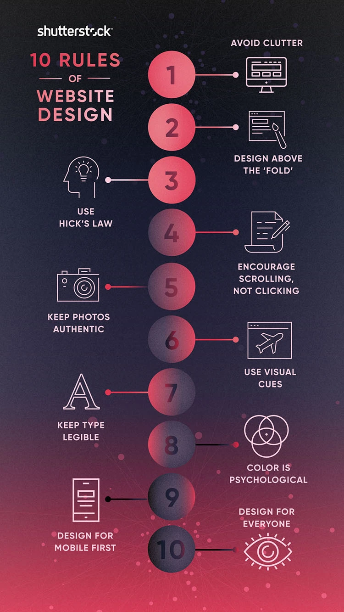

# 웹 사이트 디자인

1. 어수선함 피하기: 이미지, 버튼 등 너무 많이 배열되어 있거나 불규칙적이면 사용자 경험에 악영향을 준다. 레이아웃이 어수선하면 안되고 여백을 적절하게 활용해야 한다.

2. 폴드(브라우저 아래의 경계 부분) 상단의 디자인을 우선시 하기: 핵심 컨텐츠가 밑에 있으면 사용자는 시작부터 스크롤을 계속 해야됨

3. 힉 하이먼 법칙을 명심하기: 선택지가 늘어나면 개인이 결정하는 시간이 크게 늘어남. 하나의 바로 동작하는 액션이 긴 옵션보다 효과적

4. 클릭보다 스크롤을 장려하기: 클릭은 로딩 시간도 걸리고 스크롤이 더 여유롭기 때문에 사용자가 사이트에 더 오래 머뭄

5. 진정성 있고 자연스러운 사진 사용하기: 인위적인 사진보다는 자연스럽고 친근한 이미지가 더 사용자들에게 호감을 끌어냄

6. 시각적인 단서 사용하기: 화살표 같은 직접적인 이미지 사용이 방문객의 행동을 이끌어 내는데 효과적

7. 서체는 가독성을 우선시하기: 독특하고 힙한 글씨체보다는 깔끔한 글씨체가 효과적. 산세리프체나 굵은 디스플레이 형태가 웹 사이트에 잘 어울림

8. 색채심리: 방문객에게 제대로 된 인상을 줄 수 있는 색상을 선택. 기능에 맞는 적절한 퍼스널 컬러

9. 모바일용 페이지를 먼저 디자인하기: 일부 분야에서 모바일 사용자의 비율이 훨씬 더 높음

10. 모두를 위한 디자인: 검정 텍스트를 하얀 배경과 함께 사용하는 등 레이아웃에서 색상 대조를 높이고 큰 크기의 산세리프체를 적용하는 것이 더 잘 보이고 많은 사람에게 접근 가능함

## 웹 사이트 디자인 시작할 때

1단계: 사이트의 아이덴티티 구축하기
사이트 전체의 통일성이 있어야하고 아이콘, 로고, 서체, 색채 배합이 아이덴티티에 맞아여함

2단계: 사이트의 홈페이지 구축하기
홈페이지는 스타일 톤을 설정해야 하고 시각적 단서나 메뉴를 통해 사용자를 다른 페이지로 이끌 수 있어야 함.
시각적 단서를 사용하여 사용자의 주목을 헤드라인과 버튼으로 향하게 해야

3단계: 다른 페이지를 위한 서식 만들기
카테고리, 서비스, 제품, 뉴스 등등 기능에 따라 적절하게 설정
와이어프레임 팁(https://www.shutterstock.com/blog/building-website-wireframe-tips)

## 웹 디자인 트렌트 2023

https://www.nextree.io/2023-webdijain-teurendeu/

## 다른 사이트들 디자인 소개

https://www.gdweb.co.kr/main/

## 피그마 사용법

https://niltok.oopy.io/49026060-840e-4075-a19c-727df6af62e4
